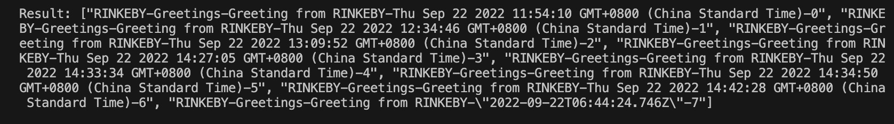
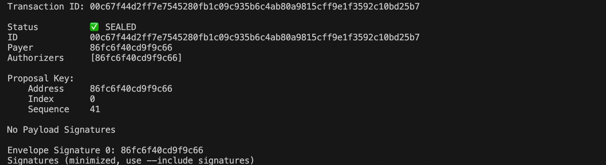

# Demos for Omniverse Interoperation

This `repo` provides demos showing common message communication and contracts invocation between Flow Testnet and other chains(Currently Rinkeby is ready).  
This is a "Nightly" branch for development. New features will be published here as soon as we make progresses.  
The Testnet for omniverse dApp developers is ready now.

# Current Work flow
We provide two situations:
- **Greetings**
  * User α sends a greeting message to the greeting contract on chain A.
  * Greeting contract call cross-chain contract of DANTE on chain A.
  * DANTE cross-chain service sync message from chain A to chain B.
  * User β query greeting message on chain B.

- **Computation**
  * User α sends a transaction for a simple computation to the calculation contract on chain A.
  * Calculation contract on chain A call cross-chain contract of DANTE on chain A.
  * DANTE cross-chain service sync the calling information from chain A to chain B.
  * Calculation contract on chain B make the real computation with its own mode(maybe it's a special mode like VC based on zk-snark).
  * Calculation contract on chain B call cross-chain contract of DANTE to return the result of the computation to chain A.
  * DANTE cross-chain service sync the result information from chain B to chain A.
  * User α query the result on chain A.

## Usage

### Install
```
npm install -d
```

### Install Flow CLI
If you are using Ubuntu OS, execute the following command to install
```
sh -ci "$(curl -fsSL https://storage.googleapis.com/flow-cli/install.sh)"
```

Check [Install the Flow CLI](https://developers.flow.com/tools/flow-cli/install) for guides on other OS.

### Test script

#### **Interoperation between `Flow Testnet` and `Rinkeby`** 
 
- Send greeting from `Rinkeby` to `Flow Testnet`. 

  - Send greeting from `Rinkeby` with command
  
  ```
  node rinkebyToFlow.js --greet
  ```
  
  


  - Check what happened on [Rinkeby greeting smart contract](https://rinkeby.etherscan.io/address/0x71375852616ef7196B07bA3f16805B512e21813E)
  
  

  
  - Query result on `Flow Testnet` with command
  
  **Perhaps you must wait for one minute for message synchronization**
  
  ```
  cd flow-demo/exampleApp/greetings 
  flow scripts execute ./scripts/getRecvedGreetings.cdc -n testnet
  ```

  
  

- Send greeting from `Flow Testnet` to `Rinkeby`

  - Send greeting with **Greeting** contract on `Flow Testnet`

  ```
  cd flow-demo/exampleApp/greetings 
  flow transactions send ./transactions/sendMessageOut.cdc "RINKEBY" "[113,55,88,82,97,110,247,25,107,7,186,63,22,128,91,81,46,33,129,62]" "[45,67,104,34]" 0x86fc6f40cd9f9c66 -n testnet --signer testnet-account
  ```

  
    
  - Check related transaction on [FlowTestnet Scan](https://testnet.flowscan.org/transaction/00c67f44d2ff7e7545280fb1c09c935b6c4ab80a9815cff9e1f3592c10bd25b7)
  
  


  - Query result on `Rinkeby` with command
  
  **Perhaps you must wait for one minute for message synchronization**
  ```
  node flowToRinkeby.js --query
  ```
  
  


- Send outsourcing computing task from `Rinkeby` to `Flow Testnet`. 
  - Send message from `Rinkeby` with command
  ```
  node rinkebyToFlow.js --compute 9,9,8
  ```
  
  - Check what happened on [Rinkeby occomputing smart contract](https://rinkeby.etherscan.io/address/0x6Aa89C654907445a35Da1109C5fD7A75F1546Ef6)
  
  

  - Wait for result
  
  


- Send outsourcing computing task from `Flow Testnet` to `Rinkeby`. 
  - Send message from `Flow Testnet` with command
  
  ```
    cd flow-demo/exampleApp/computation 
    flow transactions send ./transactions/CallOut.cdc "RINKEBY" "[106,168,156,101,73,7,68,90,53,218,17,9,197,253,122,117,241,84,110,246]" "[71, 229, 10, 66]" '[1, 2, 3, 4, 5]' -n testnet --signer testnet-operator

  ```
  

  - Check related transaction on [FlowTestnet Scan](https://testnet.flowscan.org/transaction/42a49c80f897b604c8e90d7f5e3bd69347f2deaa7b656423c4c4aa6698836f2d)
  
  
  

  - Checkout result
  
  **Perhaps you must wait for one minute for message synchronization**
  
  ```
   cd flow-demo/exampleApp/computation
   flow scripts execute ./scripts/getComputeResults.cdc 0xc133efc4b43676a0 -n testnet
  ```
  

#### **Interoperation between `PlatON` and `NEAR`**  

**Check related transaction on [PlatON Scan](https://scan.platon.network/)**  
**Check related transaction on [Near Scan](https://explorer.testnet.near.org/)**

- Send greeting from `PlatON` to `NEAR`
  - Send greeting from `PlatON` with command
  ```
  node platONToNear.js --greet
  ```
  
  
  
  - Query transaction on [PlatON Scan](https://scan.platon.network/contract-detail?address=0xbd2c1e271a60281aaed8f42a91613fbd3ae18b65)
  
  - Query result
  
  After a moment, the result queryed from `Near Testnet` will be printed.
  
  

- Send outsourcing computing task from Moonbeam to NEAR
  ```
  node moonbeamToNear.js --compute 9,9,8
  ```

- Send greeting from NEAR to Moonbeam
  ```
  node nearToMoonbeam.js --greet
  ```

- Send outsourcing computing task from NEAR to Moonbeam 
  ```
  node nearToMoonbeam.js --compute 9,9,8
  ```

#### **Interoperation between `Shibuya Testnet` and `PlatON`**

A similar tutorial for interoperation between `Shibuya Testnet` and `Avalanche` has been writen [here](https://github.com/dantenetwork/cross-chain-demo/blob/main/README.md#interoperation-between-shibuya-testnet-and-avalanche).

### Other Demos
* Check more demo shows based on Dante protocol stack [here](https://github.com/dantenetwork/Demo-Show)
