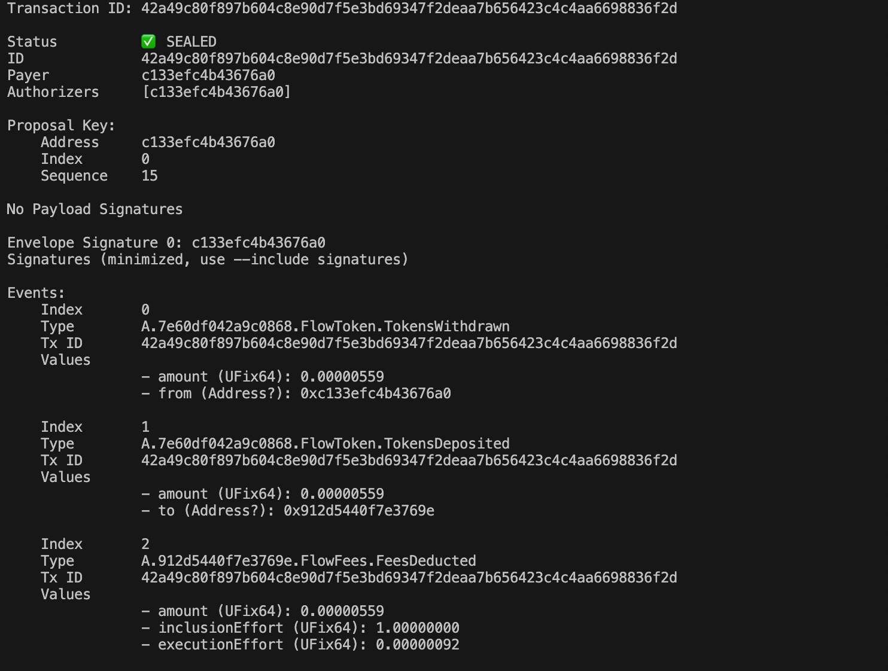
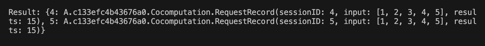

# Demos for Multichain Interoperation

This `repo` provides demos showing common message communication and contracts invocation between multi-chains.  
This is a "Nightly" branch for development. New features will be published here as soon as we make progresses.  
The test network is planned to be online in early Q3(2022).

# Current Work flow
We provide two situations:
- **Greetings**
  * User α sends a greeting message to the greeting contract on chain A.
  * Greeting contract call cross-chain contract of DANTE on chain A.
  * DANTE cross-chain service sync message from chain A to chain B.
  * User β query greeting message on chain B.

- **Computation**
  * User α sends a transaction for a simple computation to the calculation contract on chain A.
  * Calculation contract on chain A call cross-chain contract of DANTE on chain A.
  * DANTE cross-chain service sync the calling information from chain A to chain B.
  * Calculation contract on chain B make the real computation with its own mode(maybe it's a special mode like VC based on zk-snark).
  * Calculation contract on chain B call cross-chain contract of DANTE to return the result of the computation to chain A.
  * DANTE cross-chain service sync the result information from chain B to chain A.
  * User α query the result on chain A.

## Usage

### Install
```
npm install -d
```

### Prepare private key
The private key is used to sign transations which will be sent to Avalanche and Moonbeam.  
You can use the default private key file `.secret`. If the amount is not enough to pay gas fee, you can get token from faucet listed below.  

**If you do not want to use default private key file, you can create it yourself**
- Create a evm-compatible account(private key is neccessary), MetaMask will be ok
- Paste private key into the file `.secret`
- Get token for test, faucets are shown below
  - Moonbeam: https://docs.moonbeam.network/learn/platform/networks/moonbase/#moonbase-alpha-faucet
  - Avalanche: https://faucet.avax.network/

### Test script

#### **Interoperation between `Flow Testnet` and `Rinkeby`**

- Send greeting from `Rinkeby` to `Flow Testnet`. 

  - Send greeting from `Rinkeby` with command
  
  ```
  node rinkebyToFlow.js --greet
  ```
  The id will be printed to the console.

  - Check what happened on [Rinkeby greeting smart contract](https://testnet.snowtrace.io/address/0x71375852616ef7196B07bA3f16805B512e21813E)
  
  - Query result from **Greeting** contract on `Flow Testnet`

- Send greeting from `Flow Testnet` to `Rinkeby`

  - Send greeting with **Greeting** contract on `Flow Testnet`

  - Query message id
  
  After the transaction has been executed successfully, query the id of the message from **Cross Chain** contract on `Shibuya Testnet`. The id is the same as the number of all sent messages.

  - Query result on `Avalanche` with command
  
  ```
  node flowToRinkeby.js --query <ID>
  ```
  `<ID>` is the id queryed above. 
  
  - Check related transaction in [Rinkeby Scan](https://testnet.snowtrace.io/address/0x71375852616ef7196B07bA3f16805B512e21813E)

- Send outsourcing computing task from `Rinkeby` to `Flow Testnet`. 
```
node rinkebyToFlow.js --compute 9,9,8
```

- Send outsourcing computing task from `Flow Testnet` to `Rinkeby`. 
  
```
  cd exampleApp/computation 
 
  flow transactions send ./transactions/CallOut.cdc "RINKEBY" "[106,168,156,101,73,7,68,90,53,218,17,9,197,253,122,117,241,84,110,246]" "[71, 229, 10, 66]" '[1, 2, 3, 4, 5]' -n testnet --signer testnet-operator
  
```


  Check related transaction in [FlowTestnet Scan](https://testnet.flowscan.org/transaction/42a49c80f897b604c8e90d7f5e3bd69347f2deaa7b656423c4c4aa6698836f2d)
  

- Checkout result
  
```
 cd exampleApp/computation
 
 flow scripts execute ./scripts/getComputeResults.cdc 0xc133efc4b43676a0 -n testnet
```



### Other Demos
* Check more demo shows based on Dante protocol stack [here](https://github.com/dantenetwork/Demo-Show)
